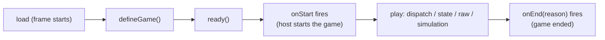

# Nova API — Game Developer Reference

The Nova API is the small, versioned interface AI-generated games use in
every mode. Games receive it as `window.nova` inside the runtime frame
(every game document starts with `nova` available), register with
`nova.defineGame`, and then react to lifecycle events. The API is the same
in the local test arena and in real parties — the transport behind it is
never visible to game code.

The authoritative source of these types is
`packages/nova-api/src/types.ts` (`@rocketcrab/nova-api`); this reference is
checked against it by the package surface tests (see
`packages/nova-api/src/index.test.ts`).

---

## 1. Core ideas (six concepts)

1. **Registration** — `nova.defineGame({ ... })` declares the game once, at
   startup, and selects its mode.
2. **Players** — `nova.player` (you) and `nova.players` (everyone), plus
   `onPlayerJoin` / `onPlayerLeave`.
3. **Lifecycle** — register, then `nova.ready()`, then the game starts
   (`onStart`) and eventually ends (`onEnd`).
4. **State** (state mode) — `nova.state` reads canonical state and
   subscribes to changes; `nova.dispatch(action)` sends actions.
5. **Raw channels** (raw mode) — `nova.raw` declares named channels and
   sends/receives JSON or binary payloads.
6. **Simulation** (simulation mode) — `nova.simulation` registers input
   handlers and sends inputs.

There is deliberately **no** notion of hosting, deployment, rooms, peers,
or authority anywhere in the API. Nova owns ordering, authority, and
migration; game code never elects or detects a host. Ordinary HTML
rendering and normal web requests are untouched — `nova` is additive.

---

## 2. A minimal game (fewer than 30 lines)

```js
// The smallest complete Nova game (state mode).
nova.defineGame({ title: "Hello Nova", mode: "state" });

// React to the game starting.
nova.onStart(function () {
  nova.log("Game started!");
});

// Announce that the game finished loading.
nova.ready();
```

Registration alone is enough for the host to run the game; the rest of the
API adds multiplayer behavior.

---

## 3. API version

`nova.version` is the API version this build speaks (currently `1`). A game
may declare the version it targets:

```js
nova.defineGame({ title: "My Game", apiVersion: 1 });
```

- An unknown `apiVersion` fails **loudly and safely**: `defineGame` throws a
  `NovaError` with code `unsupported_api_version` (in the frame, the runtime
  also rejects it).
- Calling a method this API version does not have throws a `TypeError`,
  which the runtime reports as a game error.

---

## 4. Registration

```js
nova.defineGame({
  title: "Card Game", // optional, <= 64 chars; host may override
  mode: "state", // "state" (default) | "simulation" | "raw"
  version: "1.2.0", // optional game version string, <= 32 chars
  apiVersion: 1, // optional; defaults to nova.version
  // State mode only: handler functions stay in your context and are never
  // serialized (see section 8).
  createInitialState: function (context) {
    return {};
  },
  actions: {/* name(draft, context, payload) */},
  selectView: function (state, viewer) {
    return state;
  },
  render: function (view) {
    /* optional */
  },
});
```

Rules:

- Call `defineGame` exactly once, as the first `nova` call.
- A second call throws `already_registered`.
- The declaration is plain data (it crosses the runtime frame boundary);
  state-mode handler functions are kept by Nova in the game's own context
  and never cross a boundary.
- The host-declared game id and mode can never be overridden by game code;
  game metadata is validated before it is ever forwarded.

---

## 5. Players

```js
nova.player; // { id, name } — this player, or null before the host provides identity
nova.players; // [{ id, name }, ...] — everyone, you first, join order

const off = nova.onPlayerJoin((player) => {
  /* player joined */
});
const off2 = nova.onPlayerLeave((player) => {
  /* player left */
});
```

- `id` is stable for the whole party (it survives reconnects).
- A reconnect may surface as a leave followed by a join (S1 semantics; grace
  periods land with later milestones).
- Every subscription returns an unsubscribe function.

---

## 6. Lifecycle



- **`nova.ready()`** — announce the game finished loading. Call it once,
  after `defineGame` and before the game starts.
- **`nova.onStart(fn)`** — the game began. Everything that sends data
  (`dispatch`, `raw.createChannel`, `raw.send`, `simulation.sendInput`) is
  only available after start; before that it throws `not_started` (the S1
  guarantee that API calls fail clearly before readiness).
- **`nova.onEnd(fn)`** — the game ended. `fn` receives the reason:
  `"user_exit"`, `"host_closed"`, `"authority_migrated"`, or `"error"`.
  After the end, sending calls throw `ended`.
- **`nova.onConnectionChange(fn)`** — your own connection status:
  `"connecting"`, `"connected"`, `"reconnecting"`, `"suspended"`,
  `"disconnected"`. Read the current value from `nova.connectionStatus`.
- **`nova.onError(fn)`** — API and protocol errors, delivered as
  `NovaError` objects (see the error reference below).

---

## 7. Logging

```js
nova.log("player", player, "drew a card");
```

Equivalent to `console.log`, but it is the documented logging entry point:
the runtime captures and rate-limits it (the bridge also wraps
`console.*`, so either works in the browser). Use it for anything you want
the host to surface in diagnostics.

---

## 8. State mode (`mode: "state"`, the default)

Nova owns canonical state, action ordering, deduplication, rejection, and
authority. The game only describes the rules: build the initial state,
register action handlers that mutate an Immer draft, and select each
player's view. No networking code, ever.

```js
nova.defineGame({
  title: "Draw One",
  mode: "state",
  createInitialState: function (context) {
    return { deck: ["ace", "king", "queen"], hands: {} };
  },
  actions: {
    // Validate and mutate the Immer draft. `context.actor` is the player
    // who dispatched. Returning a value replaces the draft entirely.
    drawCard: function (draft, context, payload) {
      if (draft.hands[context.actor.id]) return;
      draft.hands[context.actor.id] = draft.deck.pop();
    },
  },
  selectView: function (state, viewer) {
    // Non-authority frames receive ONLY this view — never the full state.
    return { hand: state.hands[viewer.id], cardsLeft: state.deck.length };
  },
});

// Subscribe to your selected view; render from it.
nova.state.onChange(function (view) {
  render(view);
});

// Act by dispatching a plain-data action. Resolves when the authority
// applied it; rejects with a stable error code otherwise (see below).
nova.onStart(function () {
  nova.dispatch({ type: "drawCard" }).catch(function (error) {
    // e.g. stale_revision: retry from the latest view.
  });
});

// Read your current view anytime (null before the game starts).
const current = nova.state.get();
```

### The game contract

- `createInitialState(context)` builds the canonical state (default `{}`).
- `actions[name](draft, context, payload)` runs on the current authority's
  runtime through Immer (ADR-0006); the resulting state gets a new revision.
- `selectView(state, viewer)` computes the view one player sees (default:
  the full state). Only your own view ever reaches your frame.
- `render(view)` is an optional convenience called with each new view;
  subscription-based rendering via `nova.state.onChange` is preferred.
- `context` is `{ self, players, revision, now, actor? }` — plain data.

### The action protocol

- `nova.dispatch(action)` returns a Promise that **resolves when the
  authority applied the action** (a new revision was committed) and
  **rejects with a `NovaError`** on rejection or timeout. Stable `code`s
  include `stale_revision` (your action was based on an outdated revision),
  `timed_out`, `unknown_action`, `payload_too_large`, `state_too_large`,
  `game_ended`, and `no_authority`.
- Actions are `{ type, payload?, baseRevision? }`: `type` is 1..64
  characters, `payload` must be plain JSON data, `baseRevision` defaults to
  the latest revision your frame has seen.
- Payloads must be structured-clone-compatible: no functions, no cycles, no
  `BigInt`, no DOM nodes. Violations throw `invalid_payload`.
- If two players race on the same revision, exactly one action applies; the
  other is rejected `stale_revision` — react to the new view and retry.
- Duplicate deliveries are applied exactly once (actions carry a unique id;
  the authority keeps a bounded history and replays the result).
- `nova.state.get()` / `onChange` expose your **selected view**, not the
  canonical state (ADR-0006: non-authority frames receive only their view;
  canonical state is replicated between Nova shells for migration).

---

## 9. Simulation mode (`mode: "simulation"`)

For faster continuous games. The game registers input handlers and sends
ordered inputs.

```js
nova.defineGame({ title: "Pong-ish", mode: "simulation" });

nova.simulation.register({
  onInput: (input) => {
    // input: { type, payload?, tick?, sender: { id, name } }
    applyInput(input);
  },
  onSnapshot: (snapshot) => restore(snapshot), // authoritative snapshots (later milestone)
});

nova.onStart(() => {
  nova.simulation.sendInput({ type: "move", payload: { dx: 1, dy: 0 } });
});
```

- Register handlers during setup, before the game starts.
- The simulation clock and snapshot protocol arrive with the simulation
  milestone (A1); S1 already routes inputs end-to-end.

---

## 10. Raw mode (`mode: "raw"`)

For specialized protocols. Nova provides named channels with delivery
choices, binary support, rate/size limits, transfer progress, and channel
lifecycle — but no synchronization, migration, or cheating resistance
(ADR-0006).

```js
nova.defineGame({ title: "Chatter", mode: "raw" });

nova.onStart(() => {
  nova.raw.createChannel({ name: "chat", reliable: true, ordered: true });
  nova.raw.createChannel({ name: "positions", binary: true });

  nova.raw.send("chat", { text: "hello everyone" });
  nova.raw.send("positions", new Uint8Array([1, 2, 3]));
  nova.raw.send("chat", { text: "just for Ada" }, { to: "member-2" });
});

nova.raw.onMessage("chat", (message) => {
  // message: { from: { id, name }, payload, binary }
  nova.log(message.from.name, "says", message.payload.text);
});

// Channel lifecycle (A2): close a channel when the game is done with it.
nova.onEnd(() => {
  nova.raw.close("chat");
});
```

Rules:

- **To send** on a channel, create it first (`createChannel` once per
  channel, after start; the declaration tells peers about the channel).
- **To receive**, subscribe with `onMessage(channel, fn)`; messages on
  channels with no subscription are dropped.
- **Channel lifecycle** — `close(name)` closes your declaration: local
  sends on it fail with `unknown_channel` afterwards, and peers are told
  the channel closed. A peer that declared the channel itself keeps its
  own declaration (closing is per-declaring-player). Closing an unknown
  channel is a no-op, and a closed name may be re-opened with a fresh
  `createChannel`. Peers that join **mid-game** receive every open channel
  from each player, so they can subscribe and send without a fresh
  declaration.
- Channels are just names — each player declares the channels it uses;
  anyone can send on a channel they created to any player (`to: playerId`
  targets one player, otherwise broadcast).
- Payloads are JSON data or binary (`Uint8Array` / `ArrayBuffer`).
- The channel name `nova.protocol` is reserved.

### Delivery guarantees and the Trystero mapping (A2)

Every channel declares two delivery choices; defaults are
`reliable: true, ordered: true`:

| Option     | Meaning over the arena transport (in-memory)                                                       | Over a real party (Trystero)                                                                                                                            |
| ---------- | -------------------------------------------------------------------------------------------------- | ------------------------------------------------------------------------------------------------------------------------------------------------------- |
| `reliable` | Reliable channels never drop; unreliable channels may lose messages (simulated link loss).         | All channels are delivered reliably — Trystero's data channel is always reliable (SCTP), so `reliable: false` is accepted but **degrades to reliable**. |
| `ordered`  | Ordered channels buffer and reorder by delivery stamp; unordered channels may arrive out of order. | All channels are delivered in order — Trystero's data channel is always ordered, so `ordered: false` is accepted but **degrades to ordered**.           |
| `binary`   | Binary payloads travel on the transport's binary path and bypass protocol validation.              | Same — binary payloads are supported end to end.                                                                                                        |

Games must therefore **never rely on loss or reordering for correctness**
over a real party: unreliable/unordered options express intent (and are
truly honored by the test arena), but the Trystero path only provides
reliable, ordered channels. Use per-send `{ reliable, ordered }` overrides
in `nova.raw.send` the same way.

### Size, rate, and progress (A2)

- **Size**: one raw payload is bounded by the `rawMessageBytes` hard limit
  (1 MiB; 80% warn threshold). Oversized sends are rejected with
  `payload_too_large` and counted in the host diagnostics.
- **Rate**: sends per player are bounded by `rawRatePerSecond` (120/s over
  a sliding 10-second window). Bursts beyond it are rejected with
  `rate_limited` and counted in the host diagnostics. Both thresholds live
  in `packages/protocol/src/limits.ts` beside the F6 limits.
- **Progress**: payloads above the chunk threshold travel as chunked
  transfers. Pass `onProgress({ at, bytesTransferred, totalBytes, fraction })`
  in `nova.raw.send` options to observe sender-side transfer progress
  (a plain function — it stays in your context and never crosses a
  boundary).
- **Backpressure**: `nova.raw.send` queues into the transport and returns
  immediately; failures (unknown channel, not connected, over a limit)
  surface through `nova.onError` with a stable code.

### Raw mode vs. state mode (A2)

State mode gives you canonical state, ordered actions, per-player views,
late joining, and automatic authority migration — Nova owns correctness.
Raw mode gives you channels and nothing else: **no synchronization, no
migration, no cheating resistance**, and delivery guarantees are only as
strong as the transport behind you (see the Trystero mapping above).
Prefer state mode unless the game genuinely needs a lower-level protocol;
the AI reference (A4) follows the same guidance.

---

## 11. Media (experimental — A3)

`nova.media` is the experimental camera/microphone surface. The A3 spike
(`docs/testing/media-bridging-findings.md`) evaluated how a game frame that
acquires media could publish it through the party transport; the verdict is
that cross-frame media transport is **experimental and unsupported in this
build** (Blocker Register B7): media objects cannot cross the runtime frame
boundary until device verification passes.

```js
// Acquisition stays inside your frame: ordinary browser permission prompts.
var stream = await navigator.mediaDevices.getUserMedia({ video: true });

// Probe the platform: can this realm structured-clone a MediaStream?
// false rules the whole bridge out on this platform.
var platformCanClone = nova.media.isSupported();

// Publishing is EXPERIMENTAL: in this build it always throws a NovaError
// with code "media_unsupported" (after lifecycle + input validation).
// Do not build voice/video multiplayer on nova.media yet.
try {
  nova.media.publish(stream);
} catch (error) {
  nova.log(error.code, error.message); // "media_unsupported"
}
```

Contract:

- `nova.media.isSupported()` — platform capability probe (can this realm
  structured-clone a `MediaStream`). `true` is necessary but **not
  sufficient** for the bridge; `false` means cross-frame media transfer is
  certainly unavailable on this platform.
- `nova.media.publish(trackOrStream)` — takes a live `MediaStreamTrack` or
  `MediaStream` from **this** frame (cross-realm or plain objects are
  rejected with `invalid_options`), then throws `media_unsupported` in this
  build. Lifecycle gating matches every sending call: `not_started` before
  start, `ended` after end.
- Media **never reaches the party** today: no track/stream crosses the
  frame boundary, no protocol message exists, and the data-only MVP is
  untouched. Camera/mic capture inside the game frame works (F4 verified on
  Mobile Safari) with ordinary permission prompts; permission scope is
  origin-wide (ADR-0008).

---

## 12. Errors

Every API failure is a `NovaError` with a stable `code` and a human message:

| Code                      | Meaning                                                                                                      |
| ------------------------- | ------------------------------------------------------------------------------------------------------------ |
| `unsupported_api_version` | `defineGame` targeted an API version this build cannot serve.                                                |
| `already_registered`      | `defineGame` was called more than once.                                                                      |
| `not_registered`          | A call requires `defineGame` to have run first.                                                              |
| `already_ready`           | `ready` was called more than once.                                                                           |
| `already_started`         | A lifecycle transition was attempted after the game started.                                                 |
| `not_started`             | A sending call ran before the game started (see `onStart`).                                                  |
| `ended`                   | A call ran after the game ended.                                                                             |
| `invalid_options`         | Options or arguments failed structural validation.                                                           |
| `invalid_payload`         | A payload is not structured-clone-compatible / JSON plain data.                                              |
| `unknown_channel`         | A raw send referenced a channel that was not created.                                                        |
| `reserved_channel`        | A raw channel used the reserved protocol name.                                                               |
| `rate_limited`            | A raw send exceeded the per-second rate limit (A2).                                                          |
| `not_connected`           | A targeted send referenced a player who is not connected.                                                    |
| `invalid_message`         | The host received an invalid protocol message (delivered via `onError`).                                     |
| `unsupported`             | The operation is not available in this build (reported by the runtime).                                      |
| `media_unsupported`       | `nova.media.publish` ran in a build/platform where media cannot cross the frame boundary (experimental; A3). |

Unknown methods fail as `TypeError`s (reported as game errors), never as
silent no-ops.

---

## 13. What crosses the frame

Everything a game sends through `nova` must be **structured-clone-compatible
plain data** (the same rule `postMessage` enforces). Functions registered
with `nova` (subscriptions, simulation handlers) stay inside the game's own
frame and never cross it — only data moves. Binary payloads are allowed only
on raw channels.

---

## 14. Where the API lives and why it behaves the same everywhere

- `packages/nova-api` defines the surface (`createNovaClient`) and the
  transport-neutral session engine (`NovaSession`) that drives it over the
  transport interface (`@rocketcrab/core`).
- The runtime frame bridge (`apps/runtime`) injects the same surface into
  every game document.
- The same session code runs over the in-memory transport (the test arena)
  and — later — over the party transport, so the same game code works in
  test and party transports (ADR-0003). The transport-neutral contract suite
  (`@rocketcrab/nova-api/contract-suite`) must pass over both.

---

## 15. Deliberate non-goals (S1/S2)

- S1 shipped the common surface without mode semantics; S2 shipped the full
  state-mode engine (action application, revisioned snapshots, per-player
  views, deduplication, rejections, late joining, diagnostics).
- Authority election, heartbeats, buffering during election, and migration
  arrive with S3. Until then the authority is the lowest connected member at
  game start and stays fixed for the game; if it leaves, dispatches fail
  with `no_authority` and every shell keeps the last committed state.
- No simulation clock or snapshots yet (A1).
- Raw-mode guarantees are separate from state-mode guarantees (A2).
- Since the U6 arena session router landed, the runtime forwards validated
  calls to the host (`game.apiCall`) and the host routes them into the
  player's session over the transport; session events return as
  `game.apiEvent`. State-mode execution runs through the same channel: the
  authority's frame answers `stateRequest` events with `stateResponse`
  calls, so the same game code works in the arena and over party
  transports.
