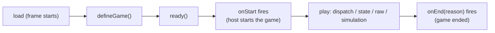

# Nova API — Game Developer Reference

The Nova API is the small, versioned interface AI-generated games use in
every mode. Games receive it as `window.nova` inside the runtime frame
(every game document starts with `nova` available), register with
`nova.defineGame`, and then react to lifecycle events. The API is the same
in the local test arena and in real parties — the transport behind it is
never visible to game code.

The authoritative source of these types is
`packages/nova-api/src/types.ts` (`@rocketcrab/nova-api`); this reference is
checked against it by the package surface tests (see
`packages/nova-api/src/index.test.ts`).

---

## 1. Core ideas (six concepts)

1. **Registration** — `nova.defineGame({ ... })` declares the game once, at
   startup, and selects its mode.
2. **Players** — `nova.player` (you) and `nova.players` (everyone), plus
   `onPlayerJoin` / `onPlayerLeave`.
3. **Lifecycle** — register, then `nova.ready()`, then the game starts
   (`onStart`) and eventually ends (`onEnd`).
4. **State** (state mode) — `nova.state` reads canonical state and
   subscribes to changes; `nova.dispatch(action)` sends actions.
5. **Raw channels** (raw mode) — `nova.raw` declares named channels and
   sends/receives JSON or binary payloads.
6. **Simulation** (simulation mode) — `nova.simulation` registers input
   handlers and sends inputs.

There is deliberately **no** notion of hosting, deployment, rooms, peers,
or authority anywhere in the API. Nova owns ordering, authority, and
migration; game code never elects or detects a host. Ordinary HTML
rendering and normal web requests are untouched — `nova` is additive.

---

## 2. A minimal game (fewer than 30 lines)

```js
// The smallest complete Nova game (state mode).
nova.defineGame({ title: "Hello Nova", mode: "state" });

// React to the game starting.
nova.onStart(function () {
  nova.log("Game started!");
});

// Announce that the game finished loading.
nova.ready();
```

Registration alone is enough for the host to run the game; the rest of the
API adds multiplayer behavior.

---

## 3. API version

`nova.version` is the API version this build speaks (currently `1`). A game
may declare the version it targets:

```js
nova.defineGame({ title: "My Game", apiVersion: 1 });
```

- An unknown `apiVersion` fails **loudly and safely**: `defineGame` throws a
  `NovaError` with code `unsupported_api_version` (in the frame, the runtime
  also rejects it).
- Calling a method this API version does not have throws a `TypeError`,
  which the runtime reports as a game error.

---

## 4. Registration

```js
nova.defineGame({
  title: "Card Game", // optional, <= 64 chars; host may override
  mode: "state", // "state" (default) | "simulation" | "raw"
  version: "1.2.0", // optional game version string, <= 32 chars
  apiVersion: 1, // optional; defaults to nova.version
});
```

Rules:

- Call `defineGame` exactly once, as the first `nova` call.
- A second call throws `already_registered`.
- Options are plain data only (they cross the runtime frame boundary — no
  functions).
- The host-declared game id and mode can never be overridden by game code;
  game metadata is validated before it is ever forwarded.

---

## 5. Players

```js
nova.player; // { id, name } — this player, or null before the host provides identity
nova.players; // [{ id, name }, ...] — everyone, you first, join order

const off = nova.onPlayerJoin((player) => {
  /* player joined */
});
const off2 = nova.onPlayerLeave((player) => {
  /* player left */
});
```

- `id` is stable for the whole party (it survives reconnects).
- A reconnect may surface as a leave followed by a join (S1 semantics; grace
  periods land with later milestones).
- Every subscription returns an unsubscribe function.

---

## 6. Lifecycle



- **`nova.ready()`** — announce the game finished loading. Call it once,
  after `defineGame` and before the game starts.
- **`nova.onStart(fn)`** — the game began. Everything that sends data
  (`dispatch`, `raw.createChannel`, `raw.send`, `simulation.sendInput`) is
  only available after start; before that it throws `not_started` (the S1
  guarantee that API calls fail clearly before readiness).
- **`nova.onEnd(fn)`** — the game ended. `fn` receives the reason:
  `"user_exit"`, `"host_closed"`, `"authority_migrated"`, or `"error"`.
  After the end, sending calls throw `ended`.
- **`nova.onConnectionChange(fn)`** — your own connection status:
  `"connecting"`, `"connected"`, `"reconnecting"`, `"suspended"`,
  `"disconnected"`. Read the current value from `nova.connectionStatus`.
- **`nova.onError(fn)`** — API and protocol errors, delivered as
  `NovaError` objects (see the error reference below).

---

## 7. Logging

```js
nova.log("player", player, "drew a card");
```

Equivalent to `console.log`, but it is the documented logging entry point:
the runtime captures and rate-limits it (the bridge also wraps
`console.*`, so either works in the browser). Use it for anything you want
the host to surface in diagnostics.

---

## 8. State mode (`mode: "state"`, the default)

Nova owns canonical state, action ordering, deduplication, and authority.
Game code describes actions; it never writes state directly.

```js
nova.defineGame({ title: "Draw One", mode: "state" });

// Subscribe to canonical state changes (fires on every applied update).
nova.state.onChange((state) => {
  render(state);
});

// When you act, dispatch a plain-data action.
nova.onStart(() => {
  nova.dispatch({ type: "drawCard", payload: { deck: "main" } });
});

// Read the current state anytime (null before the first update arrives).
const current = nova.state.get();
```

- `nova.dispatch(action)` returns a Promise that resolves once Nova accepted
  the action for delivery. Action application and rejection semantics arrive
  with the state-mode milestone (S2).
- Actions are `{ type, payload?, baseRevision? }`: `type` is 1..64
  characters, `payload` must be plain JSON data, `baseRevision` is the
  state revision the action was based on (default 0).
- Payloads must be structured-clone-compatible: no functions, no cycles, no
  `BigInt`, no DOM nodes. Violations throw `invalid_payload`.

---

## 9. Simulation mode (`mode: "simulation"`)

For faster continuous games. The game registers input handlers and sends
ordered inputs.

```js
nova.defineGame({ title: "Pong-ish", mode: "simulation" });

nova.simulation.register({
  onInput: (input) => {
    // input: { type, payload?, tick?, sender: { id, name } }
    applyInput(input);
  },
  onSnapshot: (snapshot) => restore(snapshot), // authoritative snapshots (later milestone)
});

nova.onStart(() => {
  nova.simulation.sendInput({ type: "move", payload: { dx: 1, dy: 0 } });
});
```

- Register handlers during setup, before the game starts.
- The simulation clock and snapshot protocol arrive with the simulation
  milestone (A1); S1 already routes inputs end-to-end.

---

## 10. Raw mode (`mode: "raw"`)

For specialized protocols. Nova provides named channels with delivery
choices and binary support — but no synchronization, migration, or cheating
resistance (ADR-0006).

```js
nova.defineGame({ title: "Chatter", mode: "raw" });

nova.onStart(() => {
  nova.raw.createChannel({ name: "chat", reliable: true, ordered: true });
  nova.raw.createChannel({ name: "positions", binary: true });

  nova.raw.send("chat", { text: "hello everyone" });
  nova.raw.send("positions", new Uint8Array([1, 2, 3]));
  nova.raw.send("chat", { text: "just for Ada" }, { to: "member-2" });
});

nova.raw.onMessage("chat", (message) => {
  // message: { from: { id, name }, payload, binary }
  nova.log(message.from.name, "says", message.payload.text);
});
```

Rules:

- **To send** on a channel, create it first (`createChannel` once per
  channel, after start; the declaration tells peers about the channel).
- **To receive**, subscribe with `onMessage(channel, fn)`; messages on
  channels with no subscription are dropped.
- Channels are just names — each player declares the channels it uses;
  anyone can send on a channel they created to any player (`to: playerId`
  targets one player, otherwise broadcast).
- Payloads are JSON data or binary (`Uint8Array` / `ArrayBuffer`).
- The channel name `nova.protocol` is reserved.

---

## 11. Errors

Every API failure is a `NovaError` with a stable `code` and a human message:

| Code                      | Meaning                                                                  |
| ------------------------- | ------------------------------------------------------------------------ |
| `unsupported_api_version` | `defineGame` targeted an API version this build cannot serve.            |
| `already_registered`      | `defineGame` was called more than once.                                  |
| `not_registered`          | A call requires `defineGame` to have run first.                          |
| `already_ready`           | `ready` was called more than once.                                       |
| `already_started`         | A lifecycle transition was attempted after the game started.             |
| `not_started`             | A sending call ran before the game started (see `onStart`).              |
| `ended`                   | A call ran after the game ended.                                         |
| `invalid_options`         | Options or arguments failed structural validation.                       |
| `invalid_payload`         | A payload is not structured-clone-compatible / JSON plain data.          |
| `unknown_channel`         | A raw send referenced a channel that was not created.                    |
| `reserved_channel`        | A raw channel used the reserved protocol name.                           |
| `not_connected`           | A targeted send referenced a player who is not connected.                |
| `invalid_message`         | The host received an invalid protocol message (delivered via `onError`). |
| `unsupported`             | The operation is not available in this build (reported by the runtime).  |

Unknown methods fail as `TypeError`s (reported as game errors), never as
silent no-ops.

---

## 12. What crosses the frame

Everything a game sends through `nova` must be **structured-clone-compatible
plain data** (the same rule `postMessage` enforces). Functions registered
with `nova` (subscriptions, simulation handlers) stay inside the game's own
frame and never cross it — only data moves. Binary payloads are allowed only
on raw channels.

---

## 13. Where the API lives and why it behaves the same everywhere

- `packages/nova-api` defines the surface (`createNovaClient`) and the
  transport-neutral session engine (`NovaSession`) that drives it over the
  transport interface (`@rocketcrab/core`).
- The runtime frame bridge (`apps/runtime`) injects the same surface into
  every game document.
- The same session code runs over the in-memory transport (the test arena)
  and — later — over the party transport, so the same game code works in
  test and party transports (ADR-0003). The transport-neutral contract suite
  (`@rocketcrab/nova-api/contract-suite`) must pass over both.

---

## 14. Deliberate non-goals (S1)

- No action application, snapshots, or authority election yet — those arrive
  with the state-mode and authority milestones (S2/S3); `dispatch` sends and
  `state` subscription already function over the transport.
- No simulation clock or snapshots yet (A1).
- In the browser frame, forwarded calls other than `defineGame` currently
  surface as a clear `runtime.error` (`unsupported`) because the host-side
  session router does not exist yet (the arena/party milestones wire it);
  the in-frame lifecycle guarantees everything reachable in S1 behaves like
  the arena client.
