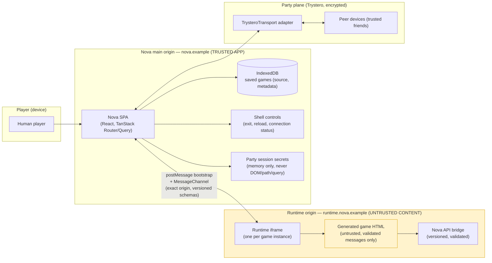

# Rocketcrab Nova — Threat Model

- **Status:** Active; reviewed as part of F3 (architecture and threat-model
  ADRs). Physical-device details land with F4; relay/TURN details land with
  F5/M3.
- **Scope:** the initial release of Rocketcrab Nova — a static, mobile-first
  web application for creating, testing, saving, and playing user-generated
  multiplayer browser games (npm workspace, see ADR-0013).

## 1. Trust boundary

Legend:

- **Inside the trust boundary (trusted):** the Nova main origin — application
  code, IndexedDB, shell controls, session secrets in memory.
- **Outside the trust boundary (untrusted):** all game content on the runtime
  origin, including the game iframe and the `nova` API bridge it uses. Game
  code is arbitrary HTML/JS; the only thing crossing the boundary is
  validated, versioned protocol messages.
- **Semi-trusted:** party peers. Admission is a social gate (ADR-0010); peers
  are trusted friends who may inspect replicated canonical state, but they are
  _not_ trusted with main-origin data or party session secrets beyond what the
  protocol grants them.

## 2. Assets and attack surface

| Asset                             | Location                                 | Why it matters                                                                                         |
| --------------------------------- | ---------------------------------------- | ------------------------------------------------------------------------------------------------------ |
| Saved game source + metadata      | IndexedDB, main origin (ADR-0005)        | The creator's work product; must never be sent to Nova infrastructure or stored on the runtime origin. |
| Party session secret              | Main-origin memory only (ADR-0011)       | Derives the private room ID and Trystero password (ADR-0004).                                          |
| Main-origin DOM, storage, cookies | Main origin                              | The application itself; must be unreachable from game code.                                            |
| Game source during play           | Transferred peer-to-peer (P3)            | Must be byte-identical (SHA-256) and only reach admitted peers.                                        |
| Canonical game state              | Replicated among party shells (ADR-0007) | Needed for migration; inspectable by peers by design (ADR-0010).                                       |
| User media (camera/mic)           | Device, granted to runtime origin (A3)   | Sensitive; user-gesture prompts, documented origin-scoped sharing (ADR-0008).                          |

## 3. Threat table

Mitigations reference ADRs, plan issues, and Blocker Register entries (B1–B8).

| #   | Threat                                                           | Category                 | Mitigation                                                                                                                                                                                                     | Owner            | Residual risk                                                                                                     |
| --- | ---------------------------------------------------------------- | ------------------------ | -------------------------------------------------------------------------------------------------------------------------------------------------------------------------------------------------------------- | ---------------- | ----------------------------------------------------------------------------------------------------------------- |
| T1  | Malicious or broken generated JavaScript                         | Code execution           | Untrusted single-HTML model (ADR-0002); game runs only on the isolated runtime origin (ADR-0001); validated versioned messages (F6); runtime bundle contains no Nova secrets/DB logic (U3); F4 isolation tests | F4, U3, F6       | A malicious game can still abuse its own frame's capabilities (see T5–T9); no static proof of safety              |
| T2  | Parent (main-origin) DOM access                                  | Isolation                | Cross-origin iframe; no same-origin access; exact-origin `postMessage` bootstrap + dedicated `MessageChannel` (U3, F6); F4 security validation asserts game cannot read main DOM                               | F4, U3           | None expected on supported browsers; re-verified per browser (F4 matrix)                                          |
| T3  | Top-level navigation (game navigates the Nova tab)               | Isolation                | Frame sandbox denies top navigation; runtime policy prevents it (M2); F4 security validation                                                                                                                   | F4, M2           | None expected; verified on physical devices                                                                       |
| T4  | Popups and downloads                                             | Isolation / nuisance     | Sandbox flags and user-gesture requirements; documented limitation; shell retains emergency stop                                                                                                               | F4, M2           | Popups may still appear on user gesture; nuisance only, not a main-origin breach                                  |
| T5  | Phishing UI inside games                                         | Social                   | Trusted-friend model (ADR-0010); game UI is visually inside the runtime frame only; browser chrome is outside the frame; README/docs warn creators and players                                                 | ADR-0010, M4     | A malicious game can display anything; players must recognize that in-game UI is not Nova UI                      |
| T6  | CPU and memory exhaustion; infinite loops                        | DoS                      | User can end/reload the game from shell controls (outside the frame, cannot be disabled by the game — U3, M1); arena restarts recreate frames (U6)                                                             | U3, U6, M1       | No hard resource caps in v1; a hung frame is recoverable but can degrade its own tab                              |
| T7  | Network tracking by game code                                    | Privacy                  | Games may use the open web by design (ADR-0009); disclosed in docs; no Nova proxy to add tracking                                                                                                              | ADR-0009, M4     | Game authors choose dependencies; players' traffic to game-selected hosts is visible to the game author           |
| T8  | Shared runtime-origin storage (game A reads game B data)         | Isolation                | ADR-0008 documents the shared boundary; Nova stores nothing sensitive on the runtime origin; parties are trusted friends (ADR-0010)                                                                            | ADR-0008, B5     | Games on the same origin may read each other's origin-scoped storage; documented, mitigated by "no secrets there" |
| T9  | Camera and microphone permissions                                | Privacy / isolation      | Acquisition happens inside the game iframe with ordinary browser prompts (A3); permission scope is origin-wide (ADR-0008); F4 matrix records behavior on Mobile Safari                                         | A3, F4, B1       | Permission granted to the runtime origin is shared by other games on that origin                                  |
| T10 | Malformed protocol messages                                      | Protocol integrity       | Every external message validated with a Zod schema (F6); version checks; unknown versions fail with useful errors; no `any` at protocol boundaries (F6, engineering rules 15/21)                               | F6, S1           | Rejection logic must be tested (F6 acceptance: invalid examples fail tests)                                       |
| T11 | Oversized payloads                                               | DoS / resource           | Message/source/snapshot/action size limits defined in F6; warnings before hard limits; chunked large transfers with progress (P3)                                                                              | F6, P3           | Limits must be tuned; oversized handling must be tested                                                           |
| T12 | Join-code guessing                                               | Unauthorized access      | Four-letter code is a public rendezvous namespace only (ADR-0004); explicit admission handshake; high-entropy private room; guessing never admits a peer (P2 acceptance)                                       | P2, ADR-0004     | Rendezvous adverts are public; only minimal party summaries are advertised                                        |
| T13 | Rendezvous-room collisions                                       | Availability / confusion | Collision detection + regeneration; collision picker in join flow (P2, P4)                                                                                                                                     | P2, P4           | Brief collision window before detection                                                                           |
| T14 | Split-brain authority                                            | Consistency              | Terms, revision comparison, state hashes, deterministic reconciliation (ADR-0007); fast-check property tests (S3); one authority wins on merge                                                                 | S3, B3           | Complex failure mode; gated on property tests before claiming robustness                                          |
| T15 | Host or authority suspension (incl. Mobile Safari backgrounding) | Availability             | Heartbeats + grace period + buffered actions; authority migration (ADR-0007); greeter migration (P2); lifecycle handling in shell (M1)                                                                         | S3, P2, M1, B6   | Brief interruption during election; rejoin restores current state                                                 |
| T16 | State inspection by trusted party peers                          | Confidentiality          | Accepted by design (ADR-0010): replicated canonical state is inspectable in dev tools; hidden-info secrecy is out of scope for v1                                                                              | ADR-0010         | Documented non-goal; game authors must not rely on secrecy from peers                                             |
| T17 | CDN and remote API failure                                       | Availability             | Nova does not proxy the web (ADR-0009); observable failures surfaced in diagnostics (U4); pinned dependency URLs recommended (A4)                                                                              | U4, P3, B4       | Third-party availability cannot be guaranteed by Nova                                                             |
| T18 | Secret leakage via URLs/logs                                     | Confidentiality          | Secrets in URL fragments only (ADR-0011); fragments not sent to static hosts (M2); imported to memory; room codes are not secrets (ADR-0004)                                                                   | ADR-0011, M2, P2 | Fragment-based invites can be stripped by some channels; QR + four-letter fallback                                |
| T19 | Game attacks the main origin via `postMessage` spoofing          | Isolation                | Exact-origin bootstrap; dedicated `MessageChannel`; versioned schema validation on every message (F6, U3)                                                                                                      | U3, F6           | Message validation must reject unknown/unsolicited senders; covered by U3 protocol tests                          |
| T20 | Runtime-origin service worker abuse                              | Isolation                | Runtime origin disables unnecessary service workers; no SW authority over main app (M2, ADR-0001)                                                                                                              | M2               | None expected                                                                                                     |
| T21 | Game disables Nova's emergency stop                              | Isolation / safety       | Stop/reload controls live outside the frame and cannot be covered or disabled by game code (U3, M1; engineering rule 20)                                                                                       | U3, M1           | Verified by F4/U3 isolation tests                                                                                 |

## 4. What Nova does not secure

Explicit non-goals for the initial release (see also ADR-0010 and the plan's
out-of-scope list):

- **Cheating / anti-cheat.** No competitive integrity guarantees; trusted
  friends are trusted.
- **Hidden-information secrecy.** Canonical state is replicated and
  inspectable by party peers in developer tools; no cryptographic
  hidden-information protocols in v1.
- **Server-authoritative game simulation.** No server-side game execution;
  authority runs on a peer and can be suspended (T15).
- **Guaranteed direct connectivity.** "Backendless" does not mean every
  connection is direct; TURN may be required (F5/M3, Blocker B2). Nova never
  ships reusable paid TURN credentials in public JavaScript (M3 acceptance).
- **Strong per-game isolation on the shared runtime origin.** Games share
  permission/storage boundaries on `runtime.nova.example` (ADR-0008, B5).
- **Third-party CDN/API reliability.** Nova diagnoses, does not proxy
  (ADR-0009, B4).
- **Safety of game content.** Games can contain phishing-style UI, tracking,
  or infinite loops; mitigation is isolation + disclosure, not censorship
  (T5–T7).
- **Protection against a determined malicious party member** beyond admission:
  a peer inside the party can cheat or read replicated state.

## 5. Validation obligations

- F4: physical-device isolation tests and capability matrix (T1–T4, T6, T9).
- F6: schema/version tests, invalid examples, size limits (T10, T11).
- S3: fast-check property tests for election/reconciliation (T14, T15).
- P2: end-to-end tests for creation, approval, rejection, collision, greeter
  migration (T12, T13, T18).
- M2: security-header and fragment verification (T18, T20).
- M1/M4: physical-device lifecycle tests and release matrix (T15).
